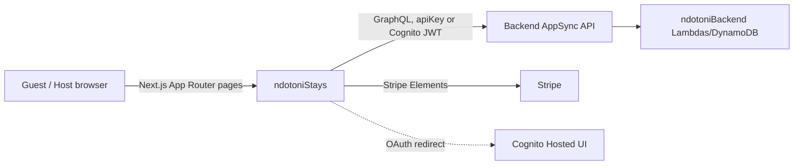

# Ndotoni Stays — Documentation Index

Next.js 14 (App Router) frontend for `ndotonistays.com`, the short-term/Airbnb-style
booking product. This doc set is for engineers and AI agents who need to understand or
debug this codebase without re-deriving it from scratch.

For local setup (install, env vars, dev server, deploy), see the
[root README](../README.md). This index is about how the app works.

## Documentation map

| Doc | Read it when you need to... |
|---|---|
| [architecture.md](./architecture.md) | Understand the tech stack, the full route map, and how data flows through the app. |
| [graphql-and-codegen.md](./graphql-and-codegen.md) | Add/change a GraphQL call, regenerate types after a backend schema change, or figure out why there are two codegen configs. |
| [auth.md](./auth.md) | Work on sign-in/sign-up, route protection, or the token-based (no-login) links used for host approval/editing. |
| [booking-and-payment.md](./booking-and-payment.md) | Work on the booking creation flow, mobile-money or card payment, or payment status polling. |

## The 60-second mental model

1. **This is a thin client over the shared backend** — almost no business logic lives
   here. Pricing, availability, booking confirmation, and payment processing are all
   backend GraphQL operations (`calculateBookingPrice`, `checkAvailability`,
   `createBooking`, `initiatePayment`, ...); this app mostly orchestrates calling them in
   the right order and rendering the result. See
   [booking-and-payment.md](./booking-and-payment.md).
2. **No middleware, no server-side route protection.** Every "protected" page
   (`/host/*`, `/profile`, `/bookings`) checks `useAuth()` client-side and shows a sign-in
   modal if needed — there's no `middleware.ts` redirecting unauthenticated requests
   before the page even renders. See [auth.md](./auth.md).
3. **Two GraphQL codegen pipelines exist; only one is live.** `src/API.ts` (Amplify-CLI
   generated) is what the whole app actually imports from. `src/generated/graphql.ts`
   (graphql-codegen generated) has zero importers — don't extend it thinking it's used.
   See [graphql-and-codegen.md](./graphql-and-codegen.md).
4. **Same Cognito user pool as `ndotoniWeb`** (the long-term-rental sister app) — a user
   account works on both `ndotoni.com` and `ndotonistays.com` without re-registering.
5. **Booking is two-phase**: create the booking record first (`createBooking`), *then*
   collect payment (`initiatePayment` for mobile money, or a Stripe PaymentIntent for
   cards) — not atomic. Payment status is tracked by **polling** `getPayment` every 10s,
   not by a GraphQL subscription.
